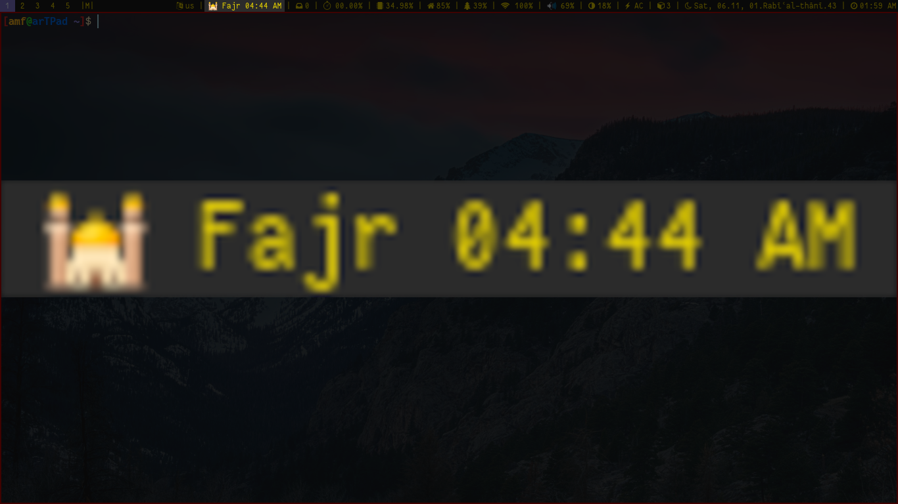

# next-prayer

[](https://github.com/marketplace/actions/super-linter)

Islamic prayers reminder for your status bar.

---

## Usage & Flags

```bash
Usage: next_prayer [options...]
Options:
 --next      The next prayer and its time.
 --prev      The previous prayer and its time.
 --hybrid    The elapsed time since the previous prayer as far as the elapsed time <= THRESHOLD.
 --left      The time left till the next prayer.
 --elapsed   The time elapsed since the previous prayer.
 --adhan     Whether the current time is adhan or not.
 --hijri     The current hijri date.
 --help      Display this help message.


This is not the full help, use (man next_prayer) for the manual.
```

---

## Setup for status bars

### [dwmblocks](https://github.com/torrinfail/dwmblocks)

**In config.h add this 4-element Block to the blocks[] array**

``` c
static const Block blocks[] = {
  /*Icon*/  /*Command*/              /*Update Interval*/  /*Update Signal*/
  {"🕌",    "next-prayer --hybrid",  29,                  0}
}
```

### [i3blocks](https://github.com/vivien/i3blocks)

**In i3blocks config add this section**

```code
[next-prayer]
command=next-prayer --hybrid
interval=29
label=<span>🕌 </span>
color=#FF8105
border=#FF8105
border_top=1
border_right=0
border_bottom=0
border_left=0
```

---

## Snapshot



---

## Installation

### For Arch based systems

```bash
yay -S next-prayer
```

### For other distros

**Install the dependencies first.**

`python3` `libnotify`

And then do:

``` code
git clone https://github.com/abdeltwabmf/next-prayer.git
cd next-prayer
make clean install
```

---

## [License](LICENSE)

Licensed under the GPL-v3 License.
